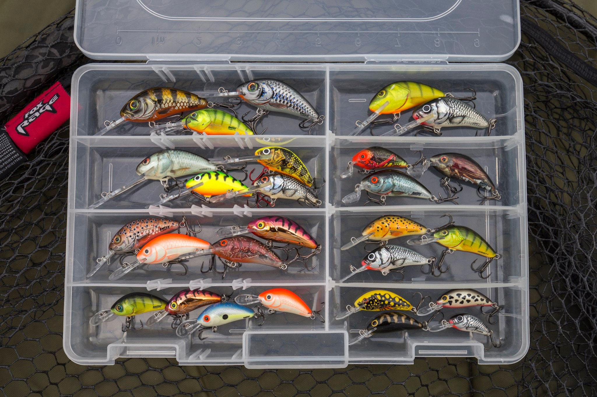

## Spinning Chub

The current growth in anglers lure fishing has seen a fantastic rise in the popularity of perch, pike and zander as target species. But there is one predatory species, native to the UK and found all over the place that has largely gone under the radar for most lure chuckers.

Chub are widespread through our river systems, they grow bigger than perch, fight dirty and during the summer and autumn months they feast on the year’s fry - making them the perfect target for a well-presented lure.

As soon as the rivers are open on I fish all summer for chub on lures - although for me it’s the months of September, October and early November that are my favourite times.

### Tacle

My personal choice is a 7’2” 3g-15g rod with preferably a hollow tip, however most ultralight rods will be more than adequate, the Ultron 2 Street 7foot 5-15gram is a great choice for this kind of work. I go for a slightly longer rod because they work better on a river where you often have rushes and other cover that you need to reach over on the margins.

When it comes to reels again a size of 1000 to 3000 loaded with 8lb to 12lb braid will work. I use 10lb braid with an 8lb fluorocarbon leader, and while an 8lb leader might seem a little strong, trust me, when you’re hooked up to a fish in the region of 5lb under far bank cover you’ll see why I use it! Chub are masters at transferring your hook from their mouth to underwater snags. I’m not sure how they do it, but they most certainly can if you don’t have the tackle to get them into clear water quickly.

The final part of my terminal tackle apart from the end lure is a small micro snap. The reason for this is that it simply allows me to change my lure quickly to suit varying swims and presentations

### Lures

Chub love surface and shallow running lures and small floating crank baits are my number one choice. There are so many to choose from but my starter for ten is the Fox Funk Bug in the 4cm Shallow Runner or 5cm Deep Runner. The 4cm version is great on small rivers in ideal conditions, while the 5cm version adds a bit of extra weight and ‘plop’ when on wider reaches or on blustery days. Although classed as a deep runner it’s still a floater and can be worked shallow if needed if you lift your rod and get your retrieve right.

In addition to a range of floating crank baits I also carry 4cm to 6cm suspending and sinking baits. Salmo lures fill this gap perfectly for me, but everyone will find their own favourites. Top water poppers also have their day especially so during the summer months.

### Colors

Personally, I don’t think colour is as important as action and ‘plop’ (which I’ll explain in a bit). Everyone has their own ‘go to’ colour but for me naturals are number one with Silver Baitfish, Real Shiner and Cool Herring attracting a lot of hits.

Salmo produce Dace, Brown Trout and Minnow versions of their lures which I’ve found work brilliantly. But these are just a few of those available and I know other anglers who have had great success on Firetiger, Bright Orange and other ‘flashy’ colours. Lure fishing is all about confidence in what you have on the end of your line and confidence helps you catch fish for sure – so my advice is to use what you think works for you.

### Hooks

Nearly all lures come equipped with one or two trebles designed to work straight out of the packet. That’s fine and you’ll catch fish on these no problems, However, I nearly always opt to change mine to singles, a personal choice, but one I find works really well for me with hook-ups and with unhooking. If you are sticking with trebles then I’d advice you to grab your pliers and close the barbs in. Trust me it makes life much easier with chub….

### Swim Selection

Chub are lovers of far bank cover, be it rafts of weed and debris or overhanging bushes and trees. Not every ‘chubby looking’ swim will hold them but many will. On a typical session, I’ll usually start with the aforementioned floating crank bait and make the first couple of casts a foot or so short or the cover I’m expecting the chub to be under. And here comes a warning! Get ready straight away and be prepared to get a surface take before you can move your lure. As I’ve said, chub come to the ‘plop’ - some lures seem to make a better ‘plop’ than others - and the number of times this happens means that you should be ready for ‘instant action’.

Getting the plop is key, so go for a high cast when possible and feathering your lure down will make it ‘plop’ as opposed to ‘splash’.  If no take comes after the initial ‘plop’ then I’ll make a steady retrieve with pauses to let the lure rise back towards the surface. After a couple of exploratory casts, I then start to work tight to the far bank snag – and by tight I mean within inches.

When I was a match angler we used to say that on the Upper Thames you needed to cast up a rat hole on the far bank to catch a chub. That thinking still holds true today. If you’re casting above the snag then when your lure reaches it you can give a short dip of the rod tip to pull your lure under it before starting your retrieve.

 After several more casts without action I’ll often change to a suspending lure. Cast above the snag and allow it to drift down in the current under the cover. When it’s under the cover I just give it a little tweak to impart action - the action can very often be the rod tip folding over as you are hooked up to ‘rubber lips’. Never be in too much of a hurry to move on. Experiment with differing lures and presentations. Very often a small change gets you that take. As you get to know stretches of river better you’ll work out the swims that are worth persevering in.

Other swims worth covering are those with beds of far bank stalks, especially when there are numbers of damsels and dragonflies in the air. Fishing very tight to the stalks will often get you an extra fish or two. Sometimes you actually need to hit the stalks to get a take.

My theory on why chub are this tight to the stalks is that damsels and many other insects have short air born lifespans. When they die they attach themselves to these stalks and as the wind catches the stalks they are dislodged into the water and into the mouth of a waiting chub.

The swims mentioned so far have all been far bank options, but as you work the river think as if you were also on the opposite bank. Your own bank bushes and reeds would look so inviting from the far bank. Think about it.

### Single hooks choices

If you leave the split ring on your lure then you’re restricted to using ‘inline’ hooks with a large ring. Whilst there are plenty to choose from, I’ve also replaced the split ring on some lures with a micro snap. This gives you several advantages. You can use your favourite hook choice (a wide gape drop shot hook works really well). Your hook is dropped slightly farther back behind the lure which had given me a better hook up rate when the fish are being a bit wary and are turning short. It also increases the number of perch you hook that follow to your feet and turn away (now they turn with a hook in the corner of their mouth).

Finally, if you balance the pressure at which the snap will open with the rest of your tackle when you apply maximum pressure from the bank you might just get an extra lure or two back when you have cast just an inch or two too close to the far bank.

See you on the water.