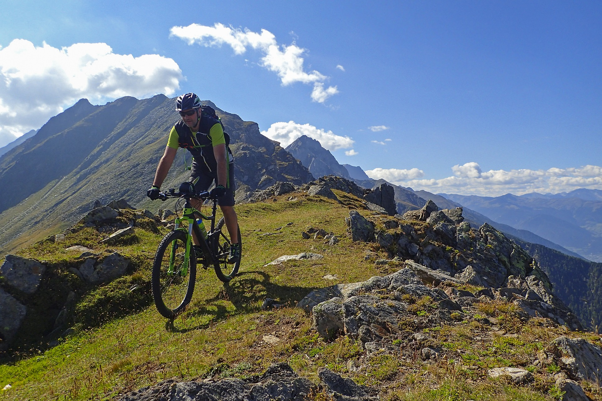

<!--StartFragment-->

The current growth in anglers lure fishing has seen a fantastic rise in the popularity of perch, pike and zander as target species. But there is one predatory species, native to the UK and found all over the place that has largely gone under the radar for most lure chuckers.

Chub are widespread through our river systems, they grow bigger than perch, fight dirty and during the summer and autumn months they feast on the year’s fry - making them the perfect target for a well-presented lure.

As soon as the rivers are open on I fish all summer for chub on lures - although for me it’s the months of September, October and early November that are my favourite times.

<!--EndFragment-->

