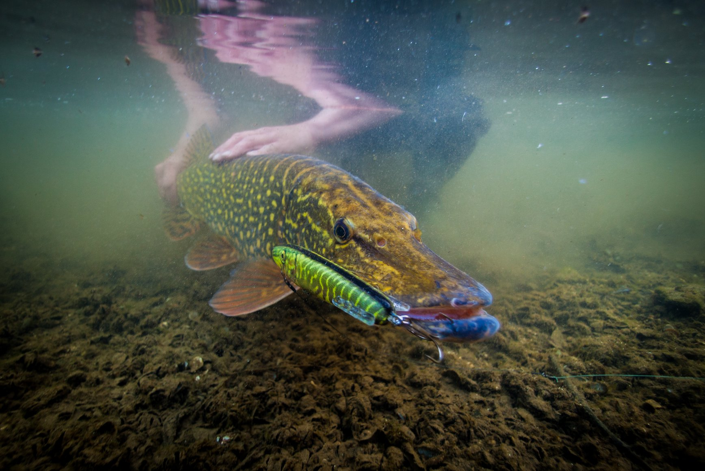
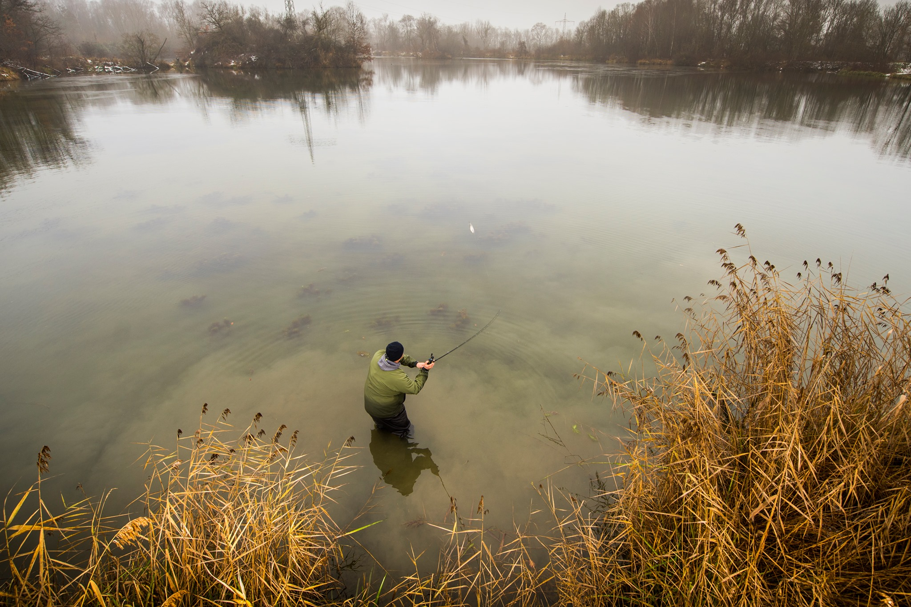
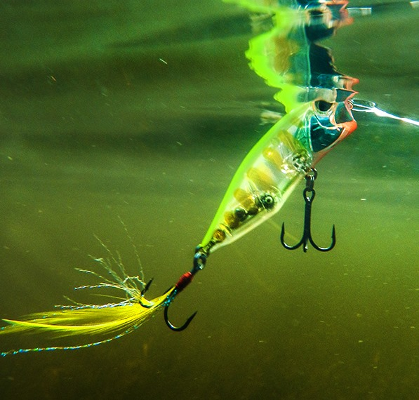
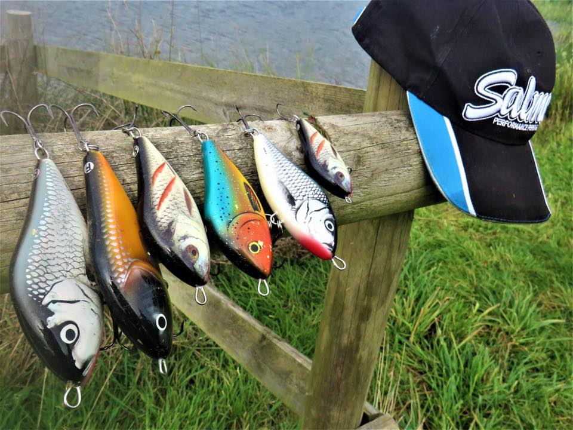
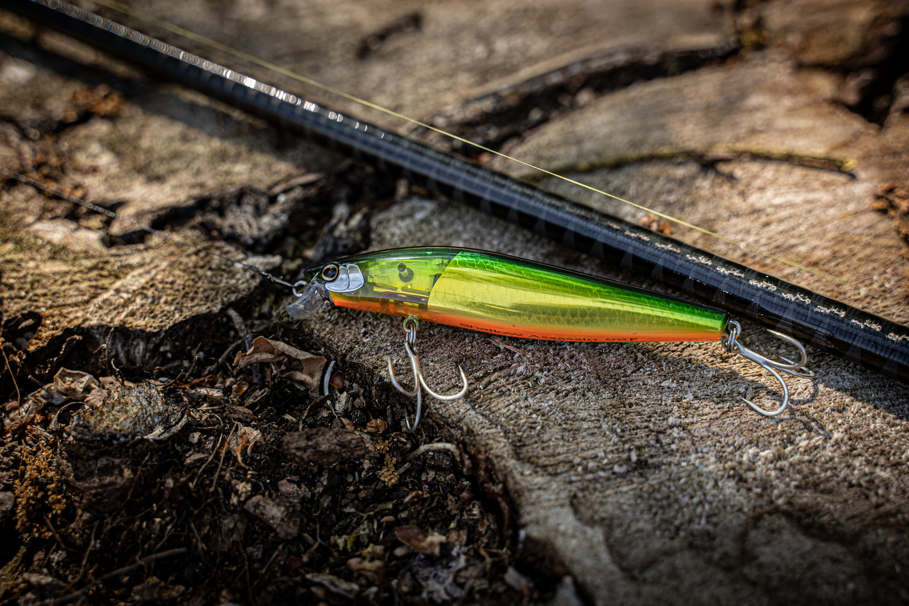
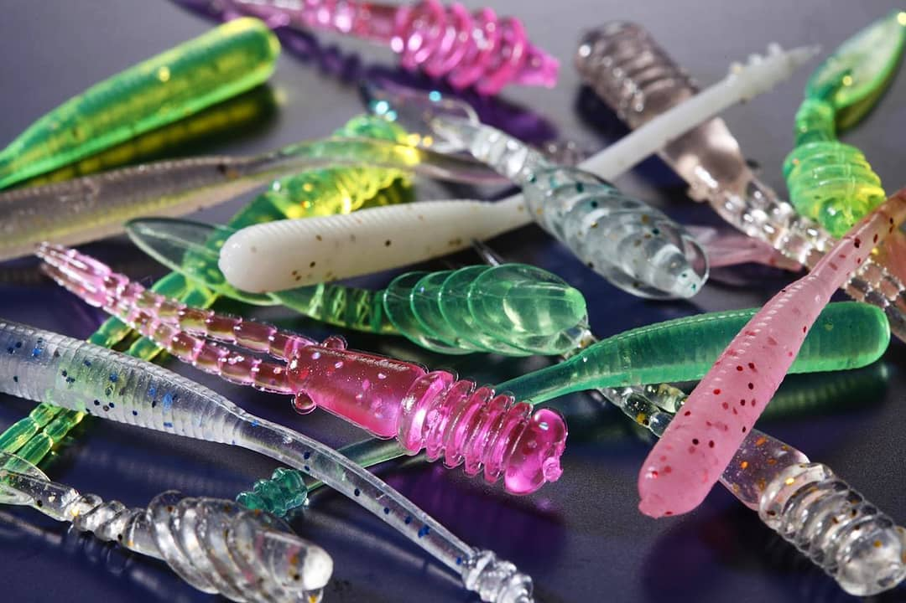
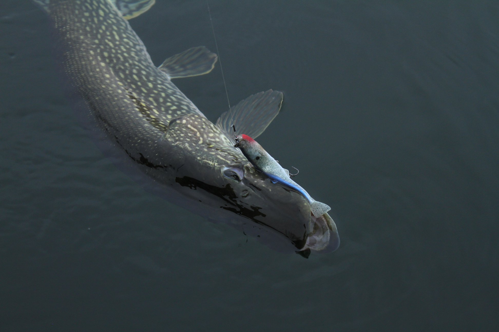
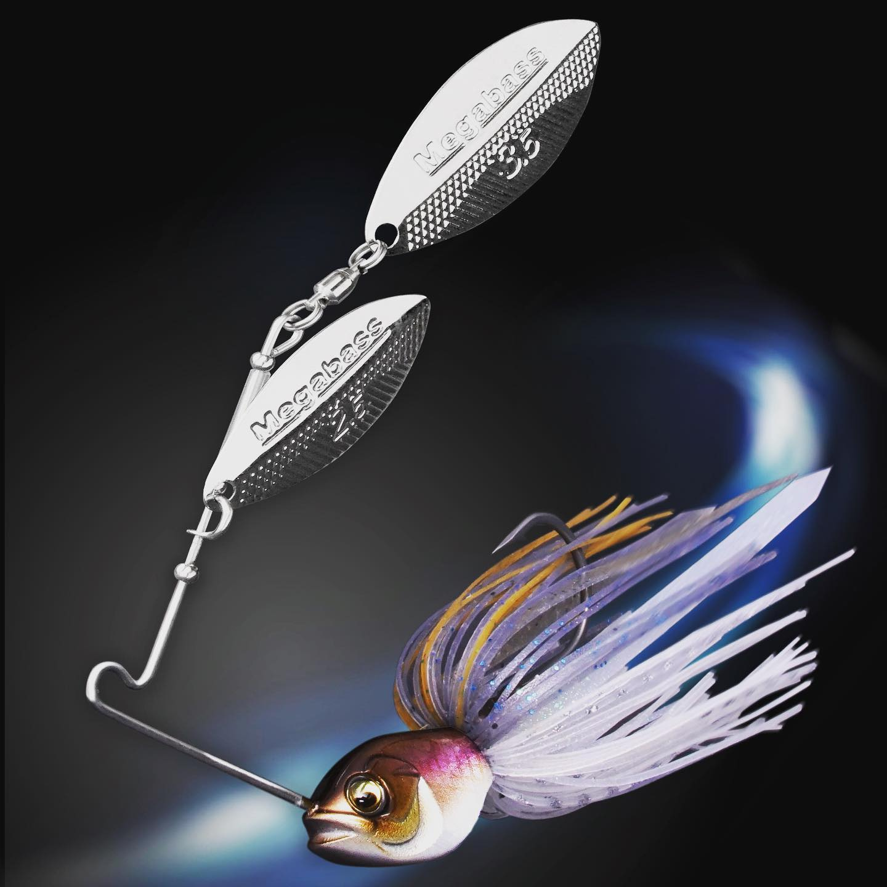

# How To Catch Pike On Lures

Nothing beats that almighty wall of resistance that you encounter when an actively hunting pike hits your lure! Tail walking, strong lunges and those ominous head shakes that resonate down your line as it tries to throw the hooks

Pike have been my chosen quarry of choice for a number of years now. From quite a young age, 16 to be exact, I was drawn to the species, I was in awe of their prehistoric looks and curious about their underwater behaviour.

Solely a die-hard dead baiting fanatic, the last 3 to 4 years have seen me really focus my efforts on lure fishing for these remarkable creatures. I have been lucky enough to have been in the company of some of the most knowledgeable lure anglers in the UK. I have learned a lot from my peers, as well as observe and learn through my own experiences.

Before taking up lure fishing, I was somewhat naive to the actual discipline. Lure fishing is an art form; it’s not just a case of casting a lure out and retrieving it. There is so much more to it! Lure colour choice, lure action, presenting the lure at the right depth, the retrieve, the location, the features, covering water etc. It’s a minefield of variables to consider! That’s what makes it so fun and so addictive.

So how do you catch pike on lures? In this article, I will be giving you an insight into how to do just that. The following information is information that I have gained from other knowledgeable lure anglers on my journey and from my very own personal experiences.

## Location

So let’s look at the most important factor when it comes to catching pike on lures, location! We can thrash the water with the best lure patterns in the world but if we haven’t located likely pike holding areas our catch rate will be relatively low.

‘Location is key’ You’ve probably heard this saying a million times before. So what are we actually looking for when we are out on the water? We are looking for underwater features. These structured areas are like motorways for fish and they allow fish to move from area to area. They provide great ambush points, which is why fish are primarily located in these areas.

## Change, Change, Change!

Unlike some lure anglers, I change lures regularly. It’s a habit I picked up from a very good lure angling friend of mine. When you’re drifting an area, you may have fish follow the lure early on in the retrieve and turn away before you even bring the lure back to the boat. If you think about it, if you’re drifting the same drift four or five times using the same lure, you’re decreasing your chances on each drift. You might encourage a fish to look at the lure but that specific lure might not have the action, colour or profile to trigger the take.

Changing my lures frequently allows me to try new lure colours, actions and body profiles. Not only does it present something new in the water but it eliminates the monotonous of working the same lure time and time again over the same body of water. It keeps me mentally focused as well as keeps me thinking!

## Strike Everything!

Sounds silly right? Striking at everything that creates any sort of instant resistance on a lure. However, I would hate to count how many fish I missed early on in my lure fishing career by not doing exactly that. If you’ve watched any modern Waterwolf footage of a lure being inhaled by a pike, they have this uncanny ability to eject a lure just as quick as they hit it. Frightening!

As I stated earlier, there is so much more to a retrieve than just casting a lure out and retrieving it. Sure, you’ll catch fish but you will also miss out on a lot of opportunities too. It’s like cracking a code, some days they will want a lure presented to them quickly and some days they will want it slow or on the pause. It is vital to mix the retrieve up.

Pike can become bored pretty quickly when a lure is tracking back at the same consistent speed, to entice the take we need to trigger them and by changing the retrieve speed we can do just that.

## Pain In The Tail!

Following on from our discussion on retrieves, there will be times within your lure fishing career that you will inevitably experience the tail nippers! This is when pike are active but not fully committing to hammering your lure. Frustrating? Absolutely!

In these circumstances, it can be hard to convert this sort of behaviour into a take, but to increase your chances of a hook up we can modify the hook arrangement on certain lures. By setting the rear hook closer to the tail of the lure. If this still does not improve hookups, soon as you feel that tail nip, speed up the retrieve with a short blast and then pause.

If a hook rearrangement still does not produce the goods – downsize! By presenting a smaller offering may help reduce your chances of hooking up

## There She Goes…

Another form of follow that you will no doubt encounter is the heart-stopping ‘follow to the boat’. There is something magical about watching a big fish follow your lure elegantly to the side of the boat to turn away at the last minute. In that moment, you are in awe of the curious specimen that your brain stops working momentarily and then after she turns away at the last minute, the thoughts of ‘what-ifs’ come rolling in -as we frantically cast again to try and cover the fish one more time.

In these scenarios, there are two tactics I like to implement – when I don’t get caught up in the moment that is.

The first one incorporates stopping the lure and letting it drop to the bottom. Usually, a percentage of fish will convert with this technique. It’s a technique I started implementing after reading an article by a reputable predator fly angler, he described how he would just stop the fly when he had a following fish that would not convert into a take, during these moments, he would stop the retrieve and let the fly sink to the depths. After reading that, I started to implement this into my own fishing and found on occasion to be a highly successful method.

The second method is covering the fish with a different lure. It amazes me how many times a pike will have a go as soon as we change our lure. It’s like we warm them up with the initial follow and then it ignites that killer instinct of theirs. Don’t get me wrong, you will inevitably have fish follow lures and just not be interested in actually taking.

If I come across following fish in a swim, I will cover that area for a good couple of hours trying different tactics to try and entice a take. If they’re not switched on though, I will then rest that area and try it again later on in my session. If I move a big fish in a specific area but she doesn’t commit, I will waypoint that area too. Usually, it’s a waiting game; we just have to wait until they switch on to that ‘feeding mode’.

## Best Pike Lures

Lure fishing for pike has become very popular over the last couple of years and there’s a good reason why!

Aggressive takes, power lunges, tail walking and menacing follows are a few of the heart-stopping scenarios that you can expect from lure fishing for these freshwater predators.

So with the lure market booming and so many various lures available. Where do you start? Well, in this article, we will cover all the different styles of lures available for pike and how they work.

### Crankbaits For Pike

A crankbait is a wooden or plastic bodied lure that has a built-in plastic or metal lip also known as a diving vane at the front of the lure. These diving vanes come in all different shapes and sizes, these determine the running depth of the lure (how deep the lure will go)

Crankbaits come in three different densities. Either a floating, suspending or sinking model. Floating crankbaits will float on the surface and when you begin to retrieve the lure it will dive. On stopping the lure, it will float back up to the surface. This is ideal for fishing snaggy bottoms or weedy bays, stopping the lure will allow it to float up passed any snags or weed. The other benefit of a floating crankbait is the way it imitates a struggling/dying fish.

The suspending models differ slightly, they are designed to keep you in the kill zone longer, meaning that if the fish are present at a certain depth, the lure can be run at this depth consistently even during the pause as the lure will slowly sink or suspend. Which could be the trigger for a take on that given day.

Sinking crankbaits are designed to be counted down to your desired depth and then retrieved back. These allow you to fish nearer the bottom while still maintaining the action of a crankbait. Crankbaits come in either a full body or a jointed body. Both have different actions, the jointed lures usually have a more erratic action than a full-bodied crank. Giving the illusion that the lure is travelling through the water quicker than it actually is. The jointed bodies will also give off more vibration through the water, which can be beneficial when fishing in murky water.

For more added attraction, crankbaits can come with a built-in rattle, made up of ball bearings located in a cavity within the body of the lure. These rattles offer added vibration and sound in the water. As stated earlier, the added noise and vibration can be beneficial when fishing in murkier waters due to the lack of visibility. Pike then have to rely on other senses to find your lure, this is when noise and vibration come into their own.

### Swimbaits For Pike

Probably the most lifelike action of all the pike lures available. These hard body lures come in 2 or 3 jointed sections. Shaped like a fish they even move like a cruising fish through the water, Like most pike lures, some swimbait variations will come with a built-in rattle. Coming in various sizes and weights, swimbaits are designed to tackle weeded shallow areas to deep drop-offs. Just like crankbaits, floating, suspending and sinking models are availabl

Fish shaped with an articulated hard body, mainly made of plastic. They have 2 to 3 joined sections. They swim with an S shape movement, like a cruising prey fish. Equipped with 2 treble hooks.

A straight retrieve is all it takes to get the best out of these lures. A stop-start retrieve can be thrown into the mix to try and entice a take

### Soft Plastic Lures For Pike

Soft plastic lures have really taken the pike lure fishing scene by storm recently with innovative 3D scans taken from real fish and printed onto the body of the lure, giving a lifelike appearance and enticing swimming action. Not only that, but these lures can be customised easily to adapt to your fishing conditions, allowing you to fish fast and shallow or slow and deep.

These are soft plastic mould injected lures that can come in various shapes and sizes. The most common shaped soft plastic lures come in either a shad shape (fish-shaped) with a paddle type tail or a large grub which has a wide curly tail. Soft plastic lures come either externally rigged or internally rigged. Manufacturers produce loose body soft plastic lures that consist of just the lure itself and has to be rigged by the individual. Most internally rigged soft plastics are classed as a ‘ready to fish’ lure. Let’s have a look at the difference between the two types of rigging:

The method or retrieve for a soft plastic lure is simple. Similar to crankbait fishing explained above, cast it out, let it sink a little to the desired depth and start your retrieve.

### Jerkbait Lures For Pike

A basic looking lure, but don’t let that fool you. Jerk baits are one of the most critically balanced lures on the market and have accounted for a number of good fish over the years. Made of wood or plastic, and designed in a fish-shaped profile. These lures are weighted differently to give them their own unique action in the water. Available in floating, suspending and sinking models.

Fish shaped and flat in profile, usually containing two treble hooks. Sometimes containing ball bearings for added vibration and attraction. Made from wood or plastic. Coming in various colourful patterns.

Built for nearly any scenario. Shallow or deep. Ideal for using when fish are active.

The action is all in the fisherman’s retrieve, by jerking the rod in a downward or sideward motion and using the reel to pick up the slack line. The rod movements impart the action into the lure, which will either glide side to side or dart and dance in a very erratic motion. Jerkbaits are versatile, in the way they can be worked, they can be fished slow or fast, shallow or deep.

### Surface Lures For Pike

Surface action pike fishing can be the ultimate visual fishing experience with heart-stopping takes and adrenaline-filled action.

Designed to imitate a creature that has fallen or are swimming on the surface. They will either have a concaved front to them called poppers, small propeller blades or fins that flap on the water. All three of these variations are designed to create noise and disturbance on the surface of the water.

Ideal for Summer pike fishing in warmer water when the pike are more active and will travel a long way for a lure. Also, use these over heavily weeded areas of water where pike will lie in ambush.

Any surface lure with a propeller or fins can be straight retrieved. However, poppers require a jerk style retrieve (same as fishing jerkbaits) The takes are explosive! 9/10 times you will see a bow wave approach the lure before the initial take.

### Spinners For Pike

The most traditional and often deadly lure type for pike fishing.

Mepp blades and spoons are covered under the spinning type. Some have rubber tails, some are rubber bodied, but if it spins in the water it is considered a spinner.

Great for all types of water but colder and deeper water without weed is where spinners perform best.

A simple cast and retrieve is all that it takes to get spinners moving. There will be a minimum speed for most spinners because they will stall in the water. Being mainly metallic, spinners are great for sinking down quickly to your target depth and fishing down there at a consistent speed or speed up and let the lure rise as you bring it in.

See you on the water.