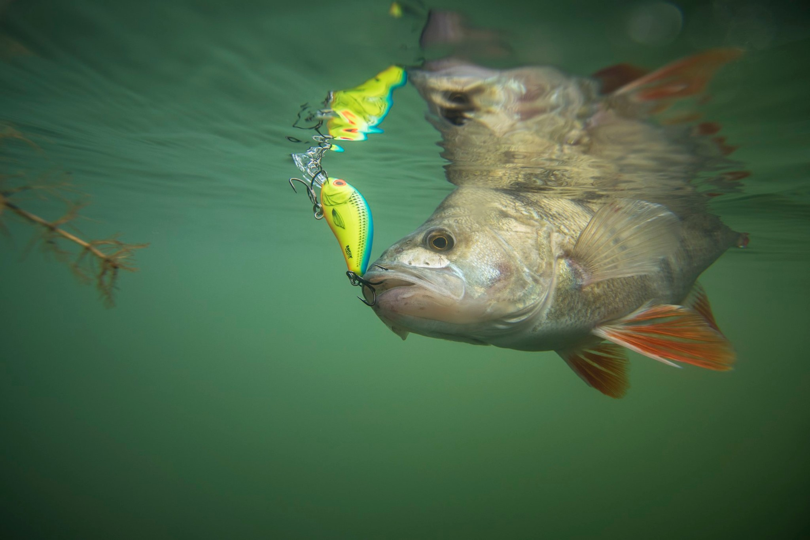
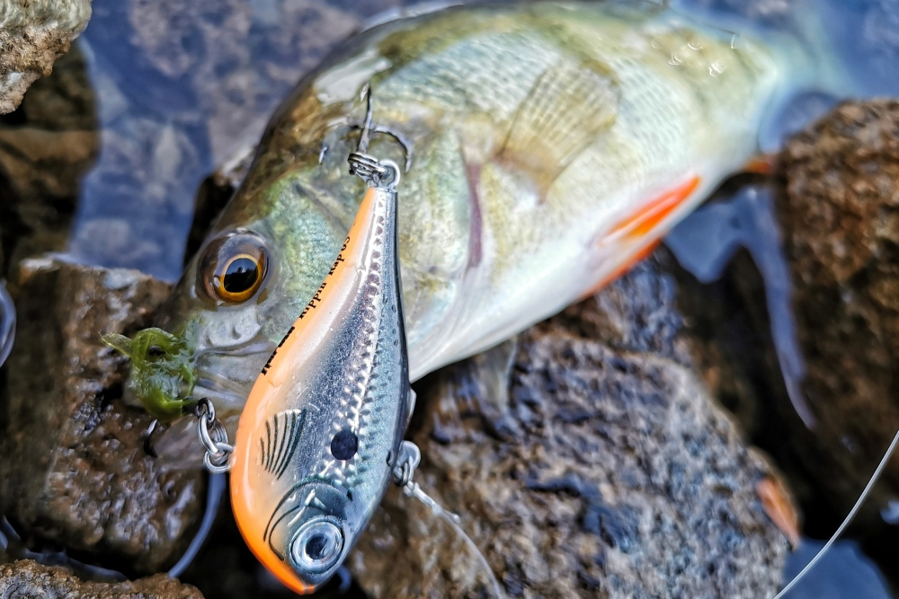

## Lure fishing for Perch

So when I think of perch, the first thing that comes to mind is it’s the first fish I ever caught, so I have very fond, if somewhat vague memories of this species. Down at my local Canal, using maggots and a small float, a little ‘stripey’ of a few ounces really started this love affair I’ve had with angling ever since. In one word, I’d describe perch as *greedy,* and this is probably why it is many peoples first fish - presentation doesn’t have to be perfect in order to catch one.. But i’ve certainly learned some interesting lessons over the years and hope you may learn a thing or 2 from this article.

 

 

Perch are one of the few predator species we can genuinely target all year round, so I will try to cover how my approach changes through out the seasons across different venues.

I’d also mention that perch are probably the most versatile of all the predator species as when I think back to how I’ve specifically targeted them in the past it can range from 1.5” micro lures on a drop shot through to huge crank baits that at first glance would appear to be straight out of my pike fishing bag.

 

However, as an intro, heres a few ‘perchy’ tips that seem to hold true no matter what the venue.

1. Perch absolutely LOVE structures. Man made structures like bridges, locks, marinas, floating platforms etc are very obvious places to target, but also consider natural features like weedbeds, bushes/overhanging trees and rushes or underwater gravel bars, pinnacles and drop offs etc
2. Perch are shoaling fish. When they are at the tiny ‘wasp’ size they can be like a swarm in the water with hundreds, if not thousands of fish in a shoal sometimes. When they get bigger, even the larger 3-4lb fish will still often be in a group of 3-12 fish, or sometimes possibly more. When you find one, you can almost guarantee others are around.
3. Perch generally like to chase a bait. They are very inquisitive and due to the fact they’re in a shoal, if they don’t get to a potential food item first, one of their mates will so they tend to be quite aggressive and quite greedy.
4. Perch are the most versatile predator fish we have in the UK and can be caught on almost every method i can think of, spinners, shads, NED rigs, chatterbaits, crank baits, creature baits, topwater, the list is endless but this makes fishing for them pretty exciting. They’re also found in almost every type of freshwater waterway we have in Europe, including canals, rivers, lakes and even semi saltwater venues.

### **Street fishing for perch**

We all love catching huge specimens but I have to admit I do really love street fishing looking for multiple bites on really light kit.

They do grow to good sizes on canals, I’ve had fish to 3lb+/45cm fish on the Basingstoke canal and perch to over 2.5lb/42cm on the Kennet and Avon, but in reality I’m expecting most fish to be in the 2oz-1lb (10-30cm) size range and so I gear up accordingly.

I’m a huge fan of using really short lightweight rods on canals, so my main canal rod is a Westin W6 Street stick at 6’1” long and 2-7g. I really love short rods for a few reasons. Firstly the physical weight of a short rod is very light so really easy to hold and carry/use all day. Secondly, a short rod, being so light makes it really easy to control your rig/lure, especially in tiny movements sometimes required in winter. Therefore I can be really really specific with my presentation and know that if I’m aiming to just move a small jig, drop shot or ned rig only an inch or 2 at a time, very specifically, then I can.

This level of finesse also becomes apparent in the sensitivity or ‘feel’ of a rod. Short sensitive rods allow everything from working out the type of bottom I’m fishing over….. its pretty easy to tell the difference between;

* silt (soft/mushy),
* gravel (hard/bouncy),
* leaves, silk weed (weight feels heavier)
* through to detecting subtle pecks and bites.

And I never forget the old phrase I learned many moons ago….. “short rods for accuracy, long rods for distance” so my short canal rods really help me throw to within inches of the far bank or really accurately around boats or bridges, or docks commonly found when streetfishing.

I couple my Street Stick with a 1000 size reel and 0.08mm braid. This usually puts the braid at about 10lb….. I know a few canal guys out there go super finesse down to 4-6lb braid (and also use lighter rods) but for me with the number of snags in city centres I find 10lb mainline gives me a really good chance of not having to re-tackle every 15 minutes!

 

A starting set up for me, lure wise, will always be a jig, so around 1.5g-3g and a 5cm-7.5cm paddle tail like Stanley the Stickleback or the Shadteez slim is perfect.\
With this rig I can both cast, and ‘dibble’ - a method i will come on to in a moment.

My jig head range for 99% of my perch canal fishing will be about 0.8-1g at the smallest and 6g at the largest, and typically the colder or harder it is, the lighter I will fish and the warm summer water may see me going heavier to fish more aggressively and really get the paddle tails working on both the rise and fall when twitching.

 

This is one thing I find works well for perch, in many instances my initial retrieve will be looking to move the lure erratically with lots of movement to attract their inquisitive and greedy nature to the lure.

### **Locations**

My first tip location wise - and probably rather obviously - is to concentrate heavily around structures. As mentioned before, bridges, locks, outflows and metal railings etc are always my first point of call. The structure around these areas will be home to many a small, invertabrate/insect/crayfish and the regular water disturbance from a lock or out flow or boat for example, will often dislodge them giving perch an easy meal.

 

The next tips on location really vary on whether you have clear or coloured water in the canals/rivers you fish. I fish a variety of canals through the year…. but I follow a pattern depending on the water clarity and this usually is a good rule of thumb.

 

Very coloured canals (visibility 1-6”) tend to be that way because boat traffic is heavy, so my first tip here will be to fish the early hours of 5-8am. Typically the boat traffic will calm down at around 6-7pm in the evening so there’s about 10-12 hours for the sediment to settle and the best visibility will therefore be that really early morning period before the boats start up again. This also couples extremely well with the ‘first light’ feeding period and is especially apt in those warmer months when the hot period in the middle of the day can be a real struggle. The lower the visibility the more I expect perch to be VERY close to structure like walls or metal sheeting and railings on the inside shelf, which usually gives a depth of 1-2m right under your rod tip. The heavy boat traffic will also tend to push fry and predatory fish up the shelves in to shallow water, *so as long as there is colour in the water* they will happily sit right in the edge, (even despite heavy bankside disturbance from cyclists, joggers etc) so fishing along the bank and right under your feet can often be the best places to find them.

 

I also think they like this near shelf for ‘orientation’ reasons. when the visibility is so low, I think they use structure as not only places to find food but also to use as patrol routes and in general as protection from other larger predators. In clear water if you were a perch… at least if you can see a pike coming, you have some defence, but in coloured water think how vulnerable you would feel if you were suspended midwater or in open water where you could be attacked from any angle. I feel like perch use structure areas to actually feel more secure, hugging along a wall and also getting the occasional free meal from invertabrates living in the cracks!

### **‘Dibbling’**

The technique of ‘dibbling’ under your rod tip is therefore an excellent one in heavily coloured canals. It took me a while to get involved in this method though, as some of the first Streetfishing predator comps I ever entered, almost all the other teams were just walking along dibbling, sometimes never making a single cast for the whole match!. I thought ‘well if this is what you need to do to compete then I’m not really very interested!’

But I soon came to learn 2 things.

* It was really only in the perch dominated matches this technique was exclusively required, when zander or pike feature heavily a casting approach is often more suitable and
* Like any method, there is actually quite a lot to learn regarding different lures, presentations and about perch behaviour.

Firstly it became apparent that all sizes of perch can be found under your feet in the summer (and/or if its heavily coloured) from tiny wasps to 40cm+ specimens, its NOT just a small fish technique. And due to the fact you can control the lure perfectly as its directly off the rod tip and very close to you, it taught me just how much perch react differently to different presentations, and a lot of what i knew about vertical jigging came in to play.

 

There are 3 presentations I tend to try when ‘dibbling’:

 

1. on occasions when the water is warm, an aggressive action can work well sometimes lifting the rod so the lure virtually touches the surface and then dropping all the way down to the bottom again, really searching the whole wall to find out what depth they are in. In this scenario don’t be afraid to fish slightly larger 7.5cm-10cm lures and sometimes (even if the visibility is only 6”) you can see a number of perch like a small swarm chasing and nipping the lure right up to the surface!
2. On the contrary, sometimes bites will only comes when fished very slow and within a few inches the bottom. When like this pin tails and fork tails can be good, as can scaling down to tiny 1-1.5” lures and try to avoid moving the lure too much (no more than a couple of inches at a time) and walking along fairly slowly. Another good technique can be to give 2 or 3 decent twitches to get their attention, but then hold the lure as still as you can, and their greedy nature means they often cant resist attacking it.
3. My third variation on ‘dibbling’ requires a straight bank you can walk along and using either a small spinner baits or - my personal favourite - a small crank bait like the Buzzbite 5cm. This is especially good in the spring and summer or when practicing for a competition where I’m looking to locate shoals of fish, as its such a good ‘searching’ method. You need to walk at a brisk pace (the speed required to make the crank work properly) and usually with about 3-6m of line out. You can cover fair distances without a bite and then get 2 or 3 bites in a short period when you locate them, then I tend to switch over to other methods (jig or dropshot) to maximise bites but its a fantastic ‘search’ method and possible to cover massive distances in a day. From a competitive point of view, its just as important to discount areas that don’t produce, as well as locate areas that do hold fish.

### **Clear Canals**

For clear canals, I find the perch will most often be down the deeper central track (still usually within 50m or so of each structure feature as a good rule of thumb) but a casting approach is best to cover that water. In these instances I’m a fan of a jig to start with, but if its hard, very cold or very clear i will definitely move across to a small drop shot with size 12 or 14 hook, with a drop usually around 6-9” and the lightest weight I can get away with, sometimes just a single AAA shot pinched on. My last thing to say on canal perch, as the main target, as mentioned, is usually small at 10-30cm, when the water is cold in Jan & Feb I have found tiny creature or ‘bug/worm/nymph’ baits to be awesome. I think small perch find it difficult to digest larger fish/fry baits and switch their diet across to smaller, softer invertebrates at this time so consider matching the hatch with natural imitations. The Westin bloodteez (5.5cm) is great and I even cut them in half when really scratching for a bite.

### Big River & Reservoir Perch Fishing

I have grouped these together as the kit and techniques I use for both are very similar. As I mentioned above, canal perch fishing for me is mostly about bites and numbers of fish, but when I head to rivers or large lakes, specifically perch fishing, I’m all out looking for 40cm+ (2lb+) fish. Rods are slightly longer and slightly more powerful with my favourite being the Westin W6 (or W3) Finesse T&C 7’1” long and 5-15g rating. I also have the 7-21g version for heavier work and crank bait fishing but the 5-15g is such a dream to catch fish on.

 

Big perch fishing is a subject I really do love. There is something very, very exciting about locating big perch on a large water, outsmarting them to bite and then watching them come up through the (generally) clear water, it’s a real sight to see. For the reservoirs that I am expecting to find perch in 30ft depth or less, then my Hummingbird Helix12 is my absolute best friend! The ability to locate the perch shoals can often be the most difficult bit on these huge waters, and when targeting the 40-50cm perch these, I can either normally see them directly on the side scan or I look use the 2D to locate bait fish shoals. If you find baitfish then predators will never be too far away. 

 

Other technology like trolling motors (I use a Minn Kota Terrova Link), can also be insanely useful when boat fishing, so much so that in certain situations - which I’ll cover in a moment - it can be the difference between catching and not catching. Remember, for this style of large perch fishing, you only need 1 or 2 bites to make your day a good one

On certain reservoirs, when we consider ‘structure’ and where to concentrate, there are obvious features like Towers and jetties, but for me, discovering other underwater features that are not visible from the surface is the really exciting bit, for 2 reasons.

 

Firstly, less people will know about them so the fish tend to get pressured/caught less, and secondly, I learn so much more about the venue and about perch behaviour in these areas….. things like how and why they relate to features depending on water temp/movement/wind, differences in hardness of the bottom, how far away their food source can be etc etc. All I urge you to do is keep your eyes and ears open, if you have a fish finder learn how to use it competently and put the hours in to find other areas where they may be. Areas with hard bottoms like gravel or mussel beds can be good, as can underwater weedlines, but also look for features on the day such as windward banks that may be stirring the bottom up, changing the water clarity, or fry scattering on the surface.

 

Theres a few methods that are useful for big perch, but my all time favourite way of targeting them is definitely power fishing and appealing to their greedy disposition. In fact each method can have its day including Ned rig, drop shot, crank baits, carolina rigs and shads presented a number of ways, but for me the real pleasure of power fishing is all in the bite, and the quicker you fish a lure the harder they will tend to hit it. There really is nothing like fishing aggressively, getting a solid SMACK for a bite followed by the reel drag singing and those characteristic head shakes of a big perch! If you can catch them like this you’ll have a very high percentage of landed fish. they’re generally ON with good hook holds and not likely to come off!

So for me this means either large, aggressive paddle tails or crankbaits will be my go-to.  With paddle tails I have zero problem fishing 4” or 5” (9-12cm) baits and fishing heavy jig heads which really force you to fish quickly and aggressively. In fact in last years WPC - UK Qualifier, myself and regular boat partner we were catching 45cm/1.5kg+ perch on 12cm baits and 20g jighwads in 4-8ft of water…… you may think its very heavy for such shallow water and you’d be right, but the lures never hit the bottom once, and we were winding almost as fast as we could reel and the bites were like pike attacks, real arm wrenchers! The Westin shadteez in 9cm (and 12cm) is an incredible big perch bait, and definitely features in my starting line up when fishing this way. For crank baits, anything in the 6-10cm size range is ideal. Theres a whole article to be written just on crank baits, as many people seem to misunderstand them, but for now heres a few tips:

 

* cold water/difficult fishing = tight wiggle crank baits and warm water/aggressive fish = wide wobble crank baits.

With rivers and reservoirs that have a bit of depth to them, where you may be fishing say 3-7m+ deep NEVER forget to fish your baits searching mid-water. Especially when they are in a feeding mood, they will often cruise and hunt very high in the water. When boat fishing, if you get a follow right to the surface from a big perch and you’re in more than say 4m depth, there’s a very high chance that fish was no where near the bottom to start with so although a ‘bumping the bottom’ approach can be a steady bet, never ignore searching the depth layers. 

However, as much as I love power fishing for big perch, there are certain times on rivers and large lakes that require a more finesse style approach. These are often days that are sunny/high pressure/no wind or times when the weather has been really cold/inconsistent, or towards the end of the season when the fishing pressure has been high and they may have been caught before and are a bit wary of larger baits. In this instance, I really like swapping over to either a drop shot or a carolina rig (or the lightest Ned rig I can get away with), these methods have little or no weight near the hook, to offer something as slow and natural as possible like a creature bait or a Westin bloodteez. Be aware though, with the nature of these light finesse rigs, that often bites will be much more subtle and you will probably have a higher proportion of missed bites or fish come off so your concentration levels have to be good to hit those bites

 

It is in these difficult circumstances that if boat fishing, quality technology like a fish finder coupled with a bow mount trolling motor, can be the difference between catching and not catching. When I’m power fishing as above, I usually like to use a drogue and drift to cover large areas of water, on the assumption that the perch are aggressive, swimming around a lot hunting and will travel to hit my lure.

 

However, if they’re not in an aggressive mood, this approach would most likely see me drifting too quickly past these finicky fish as assuming there are none in the area. With the use of technology to locate them, it can actually be a long game of cat and mouse as they don’t tend to move very far, so I aim to keep the boat close to or on top of where I think the perch will be and present a natural bait in their faces long enough for one to eventually bite. These are two very different styles but each have their day, and thats the great challenge with big perch.

### Final tips for perch

* when you hook a large perch on a reservoir or river, always watch to see if other members of the shoal follow it close to the surface. If you have a fishing partner with you get them ready to cast a lure at the followers. It happens quite frequently but the window of opportunity is sometimes only a few seconds to get that second bite. Its a real sight to see watching 2 or 3 other 40cm+ fish trying to steal a crank bait out of the mouth of the one you’ve hooked! Although it looks very aggressive this usually only happens, for whatever reason I don’t know, when the fishing is quite hard, so make the most of that opportunity!
* Don’t be afraid to fish BIG! Large perch have huge mouths and when they’re in the right mood, huge greedy appetites. I’ve had a number of 1-2kg fish on pike baits that are 6-8”+ and sometimes, especially when the water is warm, they will ignore small baits, almost as if they’re not worth the bother, so give them a meal thats worth eating!
* Clutch settings - for pike and zander, or any other really hard, bony mouth fish I have my reel drag set solid so it won’t slip a single click on the strike. However, for perch I’m happy to loosen it off slightly as standard, especially when big perch can fight so hard I really don’t want to rip the hooks out of the mouth. Pound for pound perch have got to be up there as the hardest fighters, especially once under the rod tip and if a perch wants to go, he’s off so make sure your clutch is set correctly!
* Theres definitely times when perch will attack any colour or any style lure, however, as soon as you think the fishing is getting hard DEFINITELY move across to smaller baits especially imitating natural food perch eat like small invertabrates/nymphs/worms.
* A bait that seems to have been ignored or forgotten in recent years, but should never be written off for perch is a simple, old fashioned spinner. This bait has probably caught more perch than any other bait throughout history and I won’t go perch fishing without a selection in my box. They can sometimes tempt a bite when all else fails but also consider swapping the rear treble over to a small snap clip with a single hook on for better hook ups if they swipe at the bait a lot.

So that brings me to the end of this Perch article, I hope you have enjoyed it and learned a few things along the way. 

See you on the bank asap cheers, Santiago.