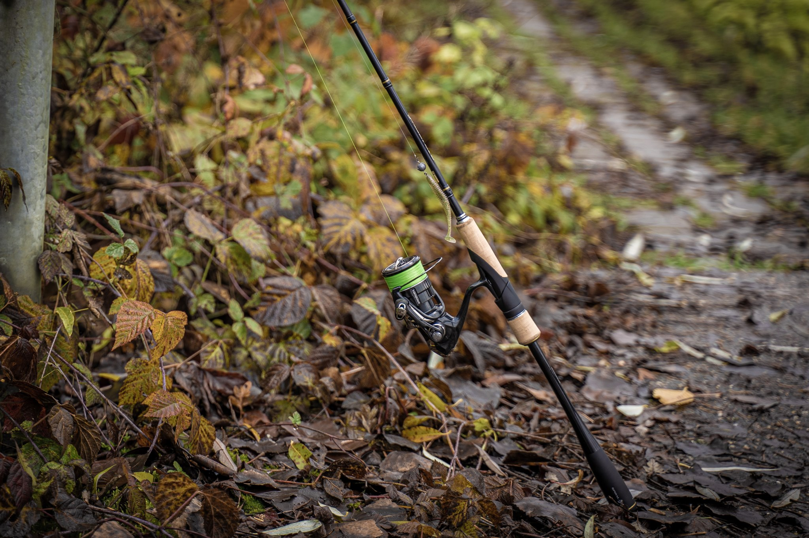

## Location and Time of Day for Zander

The cut is pretty standard in that there is a near and far side shelf that both gradient down into the increasing depths to the centre boat channel. In addition to these you will find moored boats, near and far bankside shrubbery and trees that over hang and sit in the water. Bends, bridges and sections of the canal that are surrounded by trees and therefore retain more warmth (especially prevalent in the winter months) will all have zander marauding along the length.

When targeting zander, for me, all of the above will be targeted. From late Spring to Autumn I tend to go at first light when the water tends to be slightly clearer or at last light. For some reason I find that zander switch on then and will be seen striking at fish or swirling alongside moored barges. Being active hunters (rather than hiding covertly waiting for prey) zander will be caught right across the canal and I have had a lot more success in open water in the centre of the canal at first light rather than against features. 

In the winter I tend to look for concentrated shoals of fish. I am fortunate to have miles of canal very near me and a dog that like lots of walking . I will therefore look for dippling shoals of small fish and target these areas. This seems to work well. Favoured spots being where it is slightly warmer or closed lock gates where it is slightly deeper. Bridges are also a favourite.

### The Right Rod for Zander

A typical small lure rod will be compact and light. Anything from 6 to 8 ft is ideal. Gram weight on these rods can vary but for most light lures you can use anything up to 10 grams when using soft shads and ned rigs. Up to around 15g when using hard lures . Fox, Dragon, Gunki and Westin are a few brands here that will have rods to suit the anglers needs, varying from the cheap to the extortionate in price.

My own particular preferences are the Westins W3 Street Stick (2 to 7g) which is 183cm in length (or 6ft 1 inch). This is an exceptional rod that is really light and perfect for twitching small soft shads or neds when roving along the canal path. The beauty of this rod is that its short. This means that you can stand closer to the canal edge when fishing out in front. This may seem like a mute point but in restricted pathways with people passing behind you I like to stay in contact with the lure and use the braid as detection. This saves having to stand side on when retrieving a lure.

For hard lures I prefer to use a slightly bigger rod such as the Dragon NanoLITE XT80 Spin , 213cm in length with a casting weight of 1 to 10g. I originally purchased this for small hard lure fishing for perch on the rivers but for I have had great fun with this flicking small hard lures on the local canal. Price wise, you are looking to pay 85 to £95 for this particular model.

### The Right Reel for Zander

With a small lure rod you will need a balanced small lure reel. For the type of fishing that I am doing I favour Shimano or Daiwa in either the 1000 or 2000 models. Currently I am using the Daiwa Ninja 18 2000 model and the Shimano Stradic Ci4 1000. Both of these reels have been excellent to use but the price difference varies. Whilst the Shimano is an absolute dream to use, very light and smooth, the price tag of between £150 to £180 for a new reel will turn some people away. The Daiwa Ninja however has a much lesser price tag of £65 (+/- a few quid). For the money it certainly is a very good reel to use. Smooth, light and trouble free. This reel is certainly popular amongst light lure anglers who are enjoying their sport on a budget. Well worth the money.

I have listed some other types below for your consideration. This list is not exhaustive and other brands such as Okuma and Spro for example should not be dismissed. The ‘would be’ light lure angler can also find good quality second hand bargains on ebay for example should they persist (my Shimano Stradic came from Ebay).

### The Right Line for Zander

Braided mainline is a must when lure fishing for zander on the canal. This will aid with casting those light lures and detecting those finicky plucks that are indicative of zander taking your artificial bait. Typically, on a canal you are not fishing for a British Record and the size of zander you are usually targeting will be from under a pound to 4 to 5lb. Therefor the tackle should match your quarry. I have had no problems fishing with braid from 7 to 10lb. Although I do personally favour 10lb braid throughout. This I will couple with a suitable flouro hook length of a similar breaking strength. Some of you may think this is too light for the use on the snaggy cut, however my take on this is that if I get snagged and need to pull for a break it will do easily. I would rather leave a lure and a short length of flouro in the canal (and that is only if I have to) rather than potentially leaving lengths of braided mainline as well.

If you have pike in your section of the canal or you are getting bitten off then you will have to consider using a wire trace. If you do then increasing the breaking strain of your braided mainline would be a sensible approach.

Whatever you choose here the setup should be balanced with the rod you are using. You need to remember your rod and reel need to be as light and balanced as possible.

### Lures for Catching Zander on the Canal.

There is a vast array of lures available on the market to suit your needs. Whether these be soft plastics which have really increased in popularity in the last decade or the more ‘old fashioned’ hard lures or crank baits.

Choose the type that best suits you. There is no right or wrong when choosing between them. 

### Soft Plastics

For Zander these will typically be anything from a soft shad with a paddle to curly tail to a crayfish or ned rig that sits upright on the bottom and is twitched or bounced slowly back towards you or at its location. Size of lure can be dependant on the day or prey fish you have in front of you (if known). I do tend to use soft lures from 7 to around 14cm in length. With neds I prefer to smaller size that is 7cm in length. The same goes for the crawfish/crayfish patterns.

In terms of brands, there are many. However, availability can be a bit of an issue with some. I am an advocate of using whatever I can get hold of either in shops (or in these strange COVID times) more available on the internet. Fox Rage Pro, Daiwa Prorex, Dragon V Lures, Westins Shadteez or Craws are all readily available on the internet, with some having more range in colours than others. However, if I was to pick one brand that I have had a lot of success and is available in single or multi packs then it would be the Fox Rage Pro lures. When using the Ned Rig either Zman Finesse soft baits or the Korum Snapper Squirmz will do the job.

Whatever you use ensure you have the right jig head. Some may come up short so you may find you have to up the lure size. I have recently been introduced to Cheb weights and it means I can mess around with hook to weight ratios when bouncing a lure along the bottom of a soft, muddy canal.

### Hard Lures

For Zander these will typically be anything from a soft shad with a paddle to curly tail to a crayfish or ned rig that sits upright on the bottom and is twitched or bounced slowly back towards you or at its location. Size of lure can be dependant on the day or prey fish you have in front of you (if known). I do tend to use soft lures from 7 to around 14cm in length. With neds I prefer to smaller size that is 7cm in length. The same goes for the crawfish/crayfish patterns.

In terms of brands, there are many. However, availability can be a bit of an issue with some. I am an advocate of using whatever I can get hold of either in shops (or in these strange COVID times) more available on the internet. Fox Rage Pro, Daiwa Prorex, Dragon V Lures, Westins Shadteez or Craws are all readily available on the internet, with some having more range in colours than others. However, if I was to pick one brand that I have had a lot of success and is available in single or multi packs then it would be the Fox Rage Pro lures. When using the Ned Rig either Zman Finesse soft baits or the Korum Snapper Squirmz will do the job.

Whatever you use ensure you have the right jig head. Some may come up short so you may find you have to up the lure size. I have recently been introduced to Cheb weights and it means I can mess around with hook to weight ratios when bouncing a lure along the bottom of a soft, muddy canal.

###  Cover More Water

**Zander involves some leg work. With most predator fishing it pays to cover as much water as possible, but be thorough. Don’t just do a cast here, a cast there as such.** Spend a little time in  each area. I often spend half an hour  at a time in a spot if I’m confident Zeds  are about. They are also quite partial to being in the margins so it’s always worth a cast or two. To many people tend to ignore the margins. Margins can produce when all else fails, always worth bearing in mind. 

### Use a Slow Retrieve for Zander

 Ok the retrieve can vary a lot. But for me this kind stands out amongst the rest and is my favourite style. **Use a steady retrieve with lots of long pauses,** drag slowly along the bottom, raise sharply and let the action of the lure and jighead impart movement on the drop, but keep in touch with the lure!! By using this technique I believe you stand a better chance of banking a Zander.

### Strike Hard at Every Tap

Zander sometimes take very delicately and won’t let go of the lure if you’re retrieving it slowly. **It is possible to not know the fish is there. So give it a good little strike at every tap just in case.  Due to the boney type mouth the Zander has give it a good short sharp strike to bed the hook. Hopefully the hook is nice and sharp :0)**

### Don't Give Up

**Not give up just because you have caught one fish. If you’re lucky enough to catch One Zed then there’s usually more very close by, so keep going.** Cast all around the area for a good few minutes just to make sure their big brother isn’t close by. The other fish don’t always get spooked, and may still be lying in wait. So another few casts is a must.

See you on the water.